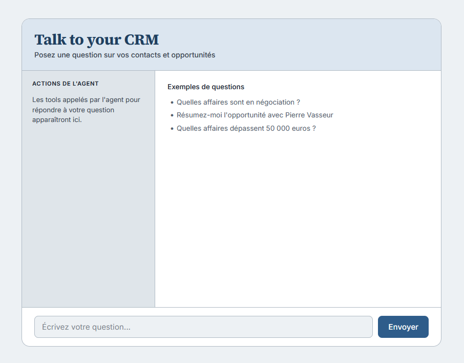

# talk-to-your-crm

Mini AI agent inspired by Salesforce Agentforce, that queries a simulated CRM database (contacts, opportunities) in natural language, using tool use with the Anthropic API (Claude).

Portfolio project, companion to the Voyalis pre-sales case study with same AI techniques (classification, generative summarization), applied to a hands-on, working system.

## What it does

Ask questions in natural language about your CRM data. The agent decides which tools to call, executes them, and answers based on real data — not guesses.

Examples:
- "Which deals are in negotiation?"
- "Summarize the opportunity with Pierre Vasseur"
- "Which opportunities are at risk?"

The agent is intentionally scoped to CRM data only. It will not give general sales advice or negotiation coaching because that judgment call is left to the sales team.

## Tools

| Tool | Purpose |
|---|---|
| `search_contacts` | Find contacts by name or company |
| `search_opportunities` | Filter opportunities by stage, contact, or amount |
| `get_opportunity_details` | Get full details, including raw notes |
| `summarize_opportunity_notes` | Plain-language summary of long/messy notes |
| `classify_opportunity_priority` | Classify category (at_risk / ready_to_close / needs_follow_up / stalled) and urgency (high / medium / low) |

## Stack

- Node.js and TypeScript
- SQLite (better-sqlite3)
- Express (web chat interface)
- Anthropic API (tool use)
- Vitest (automated tests)

## Running the project

    npm install
    cp .env.example .env   # then add your Anthropic API key
    npm run seed
    npm run dev

Open `http://localhost:3000`.

## Running the tests

    npm test

Tests cover `queries.ts` using an in-memory SQLite database (mocked), with no dependency on the real database and no API cost.

## Architecture

    src/
      db/          SQLite schema, seed data, queries, tests
      tools/       tool definitions (JSON schemas) and handlers
      agent.ts     conversation loop with the Anthropic API
      server.ts    Express server and chat route
      cli-test.ts  terminal interface for quick manual testing
    public/
      index.html   chat interface
      style.css    styling
      app.js       frontend logic

## Key design decisions

- **Scoped agent behavior**: the system prompt explicitly keeps the agent focused on CRM data, declining general sales advice which is a deliberate choice, not a limitation.
- **Conversation memory**: history is kept client-side and sent with each request, since the server itself is stateless.
- **Forced structured output**: `classify_opportunity_priority` uses a `tool_choice`-forced internal tool call to guarantee valid, structured classification rather than parsing free-form text.
- **Tool trace panel**: the web UI shows which tools were called for each answer, making the agent's reasoning visible rather than a black box.